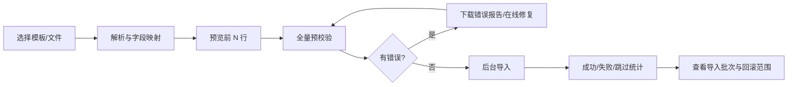

# T6 交互与视觉报告

> 版本：2026-07-22 公开资料快照  
> 用途：信息架构、交互规格、视觉原型和可用性验收  
> 说明：标为“观察”的内容来自公开手册截图/文字；尺寸和色值是近似测量，应以正式演示环境为准

## 1. 体验定位

T6 是面向熟练业务人员的高密度桌面系统。它的核心交互目标不是“第一次打开很轻松”，而是让操作、仓库、客服和财务在大量运单上快速筛选、批量处理、打印和回查。界面使用深色左侧导航、顶部多页签、状态标签、密集表格和弹窗完成工作。【观察】

若学习它，建议保留“高信息密度、批量优先、状态导向、上下文不丢”的优势；重做视觉表达，并改善主次层级、异常反馈、可访问性和复杂配置的可理解性。

## 2. 全局信息架构

### 2.1 桌面框架

```text
┌────────────────────────────────────────────────────────────────────┐
│ Logo/折叠 │ 当前已打开的页签 1 │ 页签 2 │ 页签 3       │ 用户/消息 │
├───────────┼────────────────────────────────────────────────────────┤
│ 我的主页   │ 页面标题 / 面包屑 / 上下文信息                         │
│ 运单操作   ├────────────────────────────────────────────────────────┤
│ 财务结算   │ 状态标签 + 数量                                        │
│ 渠道报价   ├────────────────────────────────────────────────────────┤
│ 统计报表   │ 主操作工具条                         字段设置 / 搜索    │
│ 尾程管理   ├────────────────────────────────────────────────────────┤
│ 资料管理   │                                                        │
│ 系统管理   │                    数据表格                            │
│           │                                                        │
│           ├────────────────────────────────────────────────────────┤
│           │ 已选择/统计              总数 / 页码 / 每页条数 / 跳转 │
└───────────┴────────────────────────────────────────────────────────┘
```

【观察】左栏按业务域组织；“运单操作”继续分业务下单、操作扫描、运单、提单、中转、提货、报关、集包和卡板。【观察】顶部多页签允许用户在订单、客户、费用和配置间保留上下文。这种结构对多任务运营很重要，但页签过多会造成查找和状态陈旧。

### 2.2 建议的框架规格

| 区域 | T6 观察 | 新产品建议 |
|---|---|---|
| 左侧导航 | 深色、固定、约 200–220px | 224px 展开/64px 折叠；保留最近与收藏 |
| 顶部 | 多页签工作区，约 50–60px | 分为全局栏和任务页签；支持固定、关闭其他、恢复关闭页 |
| 内容页 | 表格占主要空间，密度高 | 12 栏栅格；默认紧凑，可切舒适密度 |
| 主色 | 接近 Layui 青绿 `#009688` | 使用独立品牌色，不沿用 T6 的识别性组合 |
| 字号 | 大量 12–14px | 正文至少 14px；表格紧凑 13px；关键数字 16px+ |
| 行高 | 约 32–38px | 紧凑 36px、默认 40px；扫描列表可 44px |

尺寸和颜色是原型基线，不是公开产品精确 CSS 值。

## 3. 首页

### 3.1 观察到的结构

- 快捷导航；
- “我的待办”计数；
- 订单统计；
- 系统信息：版本/到期/已购模块；
- AI 智能客服、服务中心、技术协助、PDA 程序；
- 更新日志。

### 3.2 学习重点

首页本质是“进入任务”和“发现风险”，不是 BI 大屏。新产品应把它改为角色化工作台：仓库员看待收货/待出仓，客服看轨迹异常/问题件超时，财务看待审核/逾期/未核销，管理者看票量、毛利、现金和服务异常。

待办卡必须可点击并带入预设筛选；卡片数字与列表数量使用同一查询口径。避免纯装饰图表。

## 4. 列表页模式

### 4.1 页面组成

公开运单截图显示以下状态标签：全部、草稿、已预报、待收货、待分货、待转运、转运中、派送中、待发货、已发货、已上网、已签收、待退货、已退货、问题订单、问题运单、子单轨迹。【观察】每个标签可带数量。

工具条包含增加、修改客户、导入、打印、导出、单号设置、其他、轨迹操作、导入模板设置、运单记录，右侧有字段设置和搜索。【观察】不同状态应只显示合法动作，避免所有按钮长期堆叠。

### 4.2 推荐交互规则

**状态标签**

- 数量是当前权限与基础条件下的数量；用户改变全局筛选后同步刷新；
- 超过可展示宽度时可横向滚动或收进“更多状态”，不能换成两行破坏表格高度；
- 问题和超时状态使用语义色并显示严重度，不只靠颜色区分。

**表格选择与批量操作**

- 复选框选择当前页；“选择当前筛选的全部 N 条”必须二次确认；
- 批量动作先预检，返回可执行、不可执行及原因；
- 部分成功时逐行结果可下载，不能只弹“部分失败”；
- 长任务进入后台任务中心，可关闭页面并在完成后通知；
- 已选择条数、金额/重量合计固定在底部或浮动栏。

**单行操作**

- 保留双击打开详情以兼容熟练用户，但同时提供明确的“查看/编辑”入口；
- 双击动作不能与文本选择冲突；移动端不依赖双击；
- 行内只放 1–3 个高频动作，其余进入更多菜单；危险动作分组并二次确认。

**筛选与搜索**

- 顶部快速搜索支持运单号、客户单号、转单号、提单号等，并明确当前搜索字段；
- 高级筛选以抽屉/弹层呈现，支持保存为个人视图、设默认、分享给角色；
- 筛选条件以可移除标签展示，页面标题显示结果条数；
- 返回列表保留筛选、页码、滚动位置和选中行。

### 4.3 列设置和导出

【观察】T6 支持列表字段显隐、拖拽排序、设默认，以及自定义导出字段和字段顺序。

建议把“列表视图”和“导出模板”分成两个对象：

- 列表视图：字段、顺序、宽度、固定列、排序、筛选、密度；
- 导出模板：字段、标题、顺序、格式、脱敏、日期/数字格式、权限范围；
- 模板归属个人/部门/全租户；修改共享模板需要权限和版本记录；
- 导出敏感字段时写审计，并按权限自动脱敏。

## 5. 下单表单

### 5.1 观察到的结构

标准下单是宽屏密集表单，包含运单信息、材积信息、收件信息、寄件信息，并有标准/FBA 等格式页签。底部可保存到草稿、已预报或待收货，并有“保存并继续”“保存并关闭”、打印设置等动作。【观察】

### 5.2 推荐表单架构

```text
┌ 客户/渠道/服务/目的地 ─────────────────────────────────────┐
│ 客户*  渠道*  产品  目的国家*  参考号  业务员               │
├ 包裹与材积 ─────────────────────────────────────────────────┤
│ 件数/实重/尺寸/材积重/计费重   [批量粘贴] [导入] [设备读数] │
├ 收件人 ─────────────────────────────────────────────────────┤
│ 姓名/公司/电话/邮箱/国家/州/城市/邮编/地址/VAT/EORI         │
├ 申报品名 ───────────────────────────────────────────────────┤
│ 中英文品名/数量/单价/币种/税号/产地/电池液粉磁等属性        │
├ 可选区：寄件/FBA/保险/清关/平台/派送窗口/附件 ───────────────┤
│                                                              │
└ [保存草稿] [预报] [保存并继续]                 校验状态/费用预估 ┘
```

**表单原则**

- 首屏只放决定流程的字段，长尾字段按产品/渠道条件展开；
- 字段变更应立即说明对报价、限制和必填项的影响；
- 包裹/品名采用可粘贴表格，支持 Excel 多行粘贴、逐格校验和撤销；
- 地址校验不可静默改写，必须展示建议与原值；
- “草稿”“预报”“直接进入待收货”是不同后端命令，按钮名称和权限需明确；
- 离开有未保存更改的页签时提醒；提交后显示生成的运单号和下一步入口；
- FBA、海运、平台订单通过条件字段和模板扩展，不复制多套完全独立表单。

### 5.3 校验反馈

- 字段旁即时错误 + 页面顶部错误摘要；点击摘要定位字段；
- 业务规则错误说明“为什么、如何修正、谁有权限覆盖”；
- 渠道限制返回可解释条目，例如重量上限、邮编禁运、尺寸超标；
- 后端校验为准，前端校验只是提前反馈；
- 网络中断保留本地草稿或服务端临时草稿，避免重新录入。

## 6. 扫描与仓库操作

### 6.1 收货复重

公开截图表现为：顶部“操作扫描”页签，左侧扫描规则和可接受标识，中部运单信息，右侧材积行，下方已保存列表。【观察】

扫描任务不同于普通表单：输入焦点必须始终回到扫码框；成功、重复、警告、失败应有不同声音/颜色/震动；上一个结果持续显示，批次计数可见；设备重量/尺寸要显示来源、稳定状态和时间。

### 6.2 推荐状态反馈

| 状态 | 视觉/声音 | 系统行为 |
|---|---|---|
| 成功 | 绿色、短提示音 | 保存、计数 +1、清空扫码框 |
| 重复扫描 | 蓝/黄、双提示音 | 不重复写入，展示上次时间/人员 |
| 需确认 | 橙色、持续可见 | 焦点转到差异字段，人工确认 |
| 失败 | 红色、错误音 | 保留输入和错误原因，可重试 |
| 离线 | 顶部固定状态条 | 进入本地队列，展示待同步数量 |

公开资料未确认 T6 的离线机制；这是新产品的推荐增强。

## 7. 分货、查价和渠道选择

【观察】手动分货通过大弹窗列出可用代理/渠道报价，单选渠道，价格用蓝色突出并确认。

新产品应让选择可解释：

- 默认排序依据明确：总成本、预计时效、利润、服务等级或公司策略；
- 每行展示总价、币种、计费重、预计时效、限制、附加费和利润；
- 不可用渠道也可查看，并给出禁用原因；
- 展开查看计算明细和报价版本；
- “自动匹配”显示命中规则，手工改选要求原因（可配置）；
- 价格过期、汇率变化或运单重量变化时重新确认。

## 8. 订舱、提单与批次操作

公开流程是在待转运列表勾选多票，点击订舱，弹窗填写站点/类型/转运代理/渠道/订舱批号。【观察】后续维护提单和柜、确认出仓、费用、派送，并把提单轨迹关联到运单。

建议采用主从工作台：左侧提单/批次列表，中间关联运单表，右侧汇总重量、体积、件数、费用和异常。拖入/移出运单之前做兼容性预检；出仓前显示检查清单；大批量操作支持条码扫描加入。

## 9. 财务交互

### 9.1 观察到的模式

客户应收界面是客户选择/列表 + 密集数据表 + 费用明细弹窗，支持修改计费重、增加费用、审核、反审核、生成账单、锁单和核销。【观察】

### 9.2 新产品的控制原则

- 金额、币种、汇率、税率和本位币并列，禁止模糊单位；
- 已审核字段只读；修改从“反审核”或“调整单”进入；
- 审核前展示差异、异常和对利润的影响；
- 反审核、解锁、删除和冲销要求原因和权限；
- 核销弹窗展示“单据金额、已核销、待核销、本次分配、剩余”；
- 自动分配可按最早到期、单据日期、客户参考号等策略，结果可手工调整；
- 所有金额变更提供时间线，不用普通“操作成功”掩盖业务后果。

### 9.3 账单与对账

账单详情应支持冻结的账单快照、来源费用链接、客户确认/争议、附件、收款记录和导出。重新生成不能覆盖已发送账单，应创建新版或差异调整。

## 10. 权限配置交互

公开截图呈现左侧用户组、中部成员、右侧超大权限矩阵，涵盖模块、状态列表、动作和字段设置。【观察】功能强，但容易发生遗漏和水平滚动。

建议重构为：

1. 选择角色模板；
2. 设置数据范围；
3. 按业务域勾选资源和动作；
4. 只在敏感模块设置字段策略；
5. 预览“某用户最终权限”；
6. 显示与模板/上级的差异；
7. 保存后提示需要重新登录还是即时生效。

必须支持“以该用户视角预览”或权限模拟器，并列出冲突来源。危险权限如反审核、解锁、导出客户数据、查看成本应单独突出。

## 11. 弹窗、抽屉与详情页

【观察】T6 大量使用中大型弹窗，尺寸从约 600px 到接近全屏，适合在不离开列表的情况下修改单据。

推荐选择标准：

- 轻量确认/1–8 个字段：小弹窗；
- 需要对照列表的单据详情：右侧抽屉；
- 多区块、包裹/费用表、长任务：独立页签；
- 接近全屏的弹窗应直接改为页签，避免嵌套滚动；
- 弹窗内不再弹第三层弹窗；确认和取消位置统一；
- 关闭有修改的弹窗时提醒，并支持保存草稿。

## 12. 导入、导出和打印

### 12.1 导入流程



不能把上传文件后的一句“导入失败”作为结束。模板需标明版本和示例；支持列名映射；错误定位到工作表、行、列、值和规则；全量导入必须有批次号和审计。

### 12.2 打印

- 打印任务在执行前预览纸张、模板、打印机、份数和数据范围；
- 面单批量打印记录每票状态，支持失败重打且不重复业务副作用；
- 模板版本与历史单据绑定；
- 浏览器打印与本地打印服务的能力边界明确；
- 条码和二维码做可扫描性测试，不只比像素。

## 13. 通知、机器人和跨端反馈

- 每条通知明确触发来源、收件人、模板版本、发送渠道和业务对象；
- 客户可见与内部消息分离；
- 失败重试有上限，进入失败队列并告警；
- 同一事件跨客户端、公众号、个人微信、企微时需要去重策略；
- 机器人解析 Excel 或自然语言后先返回结构化预览，客户确认才创建运单；
- 敏感费用和个人信息不应发送到未授权群聊；
- 个人微信自动化可能受平台规则限制，产品必须有合规评估和降级通道。

## 14. 反馈、错误和空状态

公开文档对加载、空状态和失败反馈覆盖不足，以下是复刻时必须补齐的规范：

| 场景 | 必要反馈 |
|---|---|
| 页面加载 | 骨架/进度、保留旧数据或明确刷新；超过 10 秒可取消 |
| 无数据 | 说明是“尚未创建”还是“筛选无结果”，给创建/清筛选动作 |
| 权限不足 | 显示缺少的权限/数据范围和申请路径，不伪装成空数据 |
| 状态冲突 | 展示当前状态、是谁何时更改、可刷新/复制重做 |
| 批量失败 | 成功/失败/跳过数，逐项原因，可下载错误明细 |
| 集成失败 | 对业务人员给可行动描述，对管理员给错误码和请求 ID |
| 长任务 | 后台任务进度、可离开页面、完成通知和结果留存 |
| 破坏性操作 | 后果、影响数量、不可逆性、原因输入和二次确认 |

## 15. 键盘与高效率操作

目标用户是重度桌面操作员，应设计可发现的快捷键：

- `/` 聚焦全局搜索；
- `N` 新建，`Ctrl/Cmd+S` 保存草稿，`Ctrl/Cmd+Enter` 提交；
- 表格方向键、空格选择、Enter 查看；
- 扫描页面无需鼠标回焦；
- 快捷键面板和冲突检测；
- 关键动作不能仅靠快捷键，也有可见按钮。

快捷键是否与 T6 一致没有公开证据；这是新产品增强项。

## 16. 响应式与可访问性

内部主系统应优先支持 1440px 以上桌面，不必把复杂财务宽表强行压进手机。客户门户做响应式；仓库采用专用 PDA 任务界面。

- 颜色不是唯一状态信号；
- 焦点可见，弹窗焦点不逃逸；
- 表格标题、排序、选择与错误可被辅助技术识别；
- 输入框和按钮有明确标签；
- 关键文本对比度符合 WCAG AA；
- 数字、币种、日期、重量和尺寸单位不依赖位置猜测。

## 17. 视觉设计策略

### 17.1 可以学习

- 业务域稳定的左侧导航；
- 多页签保持工作上下文；
- 状态计数驱动任务；
- 紧凑表格和批量操作；
- 列视图、导出和打印的高可配置性；
- 扫描和财务界面的专用布局。

### 17.2 应独立重做

- Logo、产品名、图标、主色和侧栏组合；
- 所有页面文案、帮助文字、空状态插画；
- 控件皮肤、圆角、阴影、间距和动效；
- 登录页、首页模块布局和打印模板；
- 文档截图、演示数据和教程内容。

### 17.3 应主动改良

- 过多并列按钮改为主操作 + 分组菜单；
- 超大表单条件化展示；
- 接近全屏的弹窗改为任务页签；
- 报价和触发器提供解释与模拟；
- 财务动作显示业务后果和不可变日志；
- 权限矩阵增加模板、差异和用户视角预览；
- 后台任务统一进入任务中心。

## 18. 三条关键任务交互脚本

### 18.1 客户下单到仓库收货

1. 客户或业务员选择下单模板；
2. 选择客户、渠道和目的地，规则动态更新必填项；
3. 粘贴包裹与品名，校验地址/限制/报价；
4. 保存草稿或预报，获得运单号/面单；
5. 仓库扫描运单号，系统拉取预报信息；
6. 设备读取或人工输入重量和尺寸；
7. 系统对比预报差异，超阈值需确认；
8. 保存收货，状态进入待分货，记录设备与人员。

### 18.2 分货到出仓

1. 待分货列表选择一票或多票；
2. 预检所有可用渠道和不符合原因；
3. 自动规则推荐，操作员查看价格解释；
4. 确认渠道，保存报价版本和选择原因；
5. 加入订舱/提单或直接外配；
6. 出仓前检查扣货、资料、单号和仓内任务；
7. 确认出仓，触发轨迹/通知/应付；
8. 部分失败逐票修复，不回滚已完成的合法票。

### 18.3 应收到收款核销

1. 按客户/期间打开待生成应收；
2. 生成费用并检查异常计费重、汇率和缺失项；
3. 财务审核，锁定费用版本；
4. 生成人民币或原币账单并发送；
5. 登记收款或导入银行流水；
6. 自动建议核销，财务确认分配；
7. 部分核销保留余额和到期状态；
8. 全额核销后更新客户余额、欠款和报表，完整留痕。

## 19. 原型与可用性验收

### 19.1 核心指标

- 新用户在 30 分钟培训后可完成标准下单、收货和查轨迹；
- 熟练用户批量收货/分货效率不低于目标基线；
- 20 条核心任务完成率 ≥ 95%，P0 任务无阻断级错误；
- 状态/权限错误能在 10 秒内理解原因和下一步；
- 批量任务失败结果 100% 可定位到单票；
- 所有金额、重量、尺寸、币种和时间都有明确单位/时区。

### 19.2 视觉回归

若项目目标要求“观感高度接近”，应先和法务确定允许的相似边界，再建立自己的设计基线。针对 1440×900 与 1920×1080 保存页面截图，做组件级与整页差异；不要把对方截图作为生产素材。比对重点应是信息位置、可见字段、任务步骤和数据密度，而非复制其品牌表达。

### 19.3 必测异常

- 重复扫码、错仓扫码、设备数据抖动；
- 报价过期、渠道不可用、重量跨档；
- 两人同时修改同一运单；
- 已审核费用被上游运单修改；
- 批量操作中部分票被锁/扣货；
- API 超时后对方其实已成功；
- 轨迹乱序/重复、签收后又收到旧节点；
- 客户账号越权访问其他客户；
- 导入中途失败与 10,000 行错误报告；
- 页签长期打开后权限或状态已变化。

## 20. 下一轮研究清单

取得合法演示账号后，以屏幕录像和结构化记录补齐：

1. 每个角色的默认首页、菜单、列和数据范围；
2. 各状态的全部可用动作和反操作；
3. 表单字段条件、校验文案、默认值、联动和保存行为；
4. 所有空/加载/错误/超时/冲突反馈；
5. 列设置、导入、导出、打印模板的持久化范围；
6. PDA 弱网、离线、设备接入和批次操作；
7. 财务审核后修改、账单版本、核销和期间关闭；
8. 报价舍入、优先级冲突和价格解释；
9. API 幂等、限流、回调与错误码；
10. 真实数据量下的加载、筛选、导出和后台任务体验。

这些补证完成后，才能把当前的竞品报告升级为逐屏 PRD 和可直接开发的交互标注稿。
