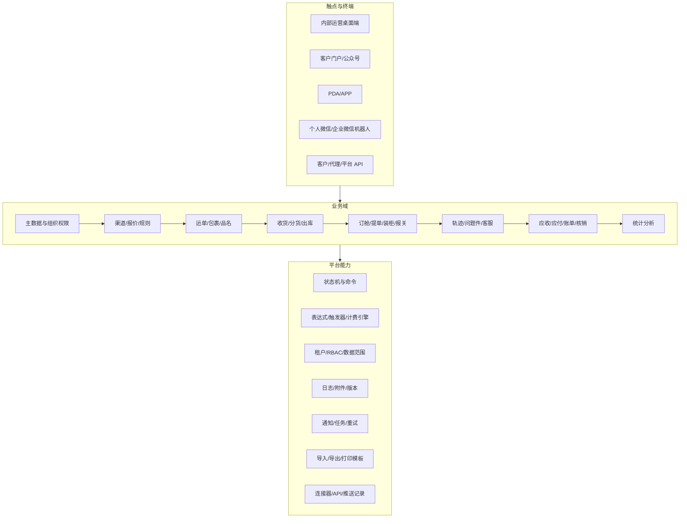
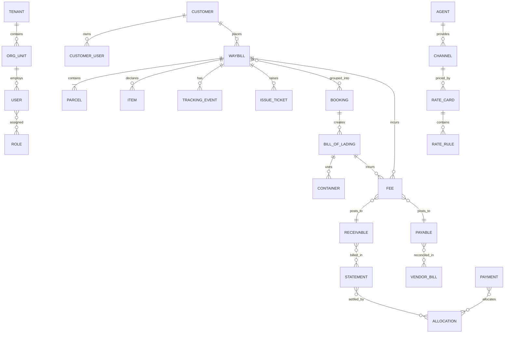
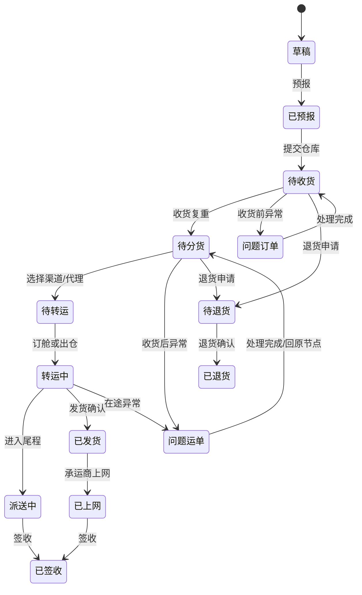
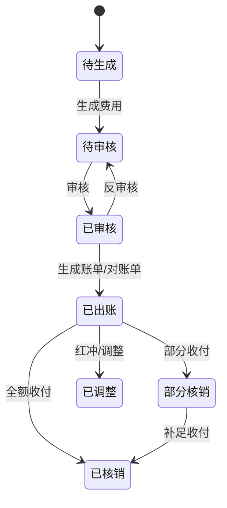

# T6 功能架构报告

> 版本：2026-07-22 公开资料快照  
> 用途：产品范围评审、领域建模、版本拆分和研发估算  
> 配套文档：[T6 竞品深度调研总报告](./2026-07-22-T6-竞品深度调研总报告.md) · [T6 交互与视觉报告](./2026-07-22-T6-交互与视觉报告.md)

## 1. 功能架构总图

产品应按三个层次建设：触点层只负责适配不同角色和设备；业务域层负责一致的领域规则；平台层统一处理状态、权限、审计、模板和集成。不要为客户门户、PDA 或机器人分别复制一套运单逻辑。

## 2. 角色与权限模型

### 2.1 可识别角色

| 角色 | 主要任务 | 典型数据范围 |
|---|---|---|
| 系统管理员 | 组织、权限、参数、模板、接口 | 全租户 |
| 业务员/销售 | 客户、报价、下单、跟进 | 本人/所属部门客户与运单 |
| 操作员 | 审核资料、分货、订舱、提单、出仓 | 站点/部门/渠道 |
| 仓库员 | 收货、复重、测量、扫描、卡板、出库 | 指定仓库 |
| 客服 | 轨迹、问题件、资料补录、扣放货 | 被分配客户/运单 |
| 财务 | 应收、应付、账单、收付、核销、流水 | 公司/部门/账套 |
| 管理者 | 首页待办、报表、利润和欠款 | 授权组织范围 |
| 客户管理员 | 客户端全部本公司数据、子账号 | 所属客户 |
| 客户联系人 | 客户端本人下单与授权数据 | 本账号/联系人 |
| 客户业务员 | 客户端被授权客户内部业务数据 | 本账号/业务范围 |
| 代理/服务商 | 接收订单、回传单号/轨迹/费用 | 合作渠道数据 |
| PDA 设备用户 | 仓内扫描和现场确认 | 设备绑定仓库/任务 |

### 2.2 推荐权限四元组

`Permission = Resource × Action × DataScope × FieldPolicy`

- Resource：模块、状态列表、单据、报表、模板；
- Action：查看、增加、修改、删除、导入、导出、打印、审核、反审核、核销、锁定等；
- DataScope：个人、岗位、部门、部门及下级、站点、仓库、公司、全部；
- FieldPolicy：不可见、脱敏、只读、可编辑。

公开权限文档可确认用户组、成员、模块/操作、状态列表和列字段配置；更细粒度的数据范围和字段写权限需在演示环境验证。所有后端命令必须再次鉴权，前端隐藏按钮不能替代权限校验。

## 3. 核心领域对象

### 3.1 对象关系

### 3.2 建议聚合边界

- **Waybill 聚合**：运单、包裹、品名、收寄件、FBA、清关、保险、业务状态；轨迹和费用通过事件/引用关联，避免一个超大事务。
- **Channel/Pricing 聚合**：渠道基础配置、区表、价格表、附加费、限制、利润和优先级；每次发布形成不可变版本。
- **Booking/BOL 聚合**：订舱批次、提单、柜、关联运单、出仓和干线轨迹。
- **AR/AP 聚合**：费用行、审核状态、账单/对账单、核销分配；审核后的金额修改通过反审核或调整单。
- **Trigger 聚合**：事件、条件表达式、动作、版本、启停和执行日志。
- **Integration 聚合**：连接器、凭证、字段映射、推送任务、请求/响应摘要、重试和幂等键。

## 4. 运单与仓库状态机

### 4.1 公开界面可确认的状态

图中“回原节点”的精确规则未在公开文档完整确认，生产设计应使用主状态 + 异常工单的并行模型，避免用“问题运单”覆盖原业务位置。每次迁移需记录：发起人、时间、来源端、前后状态、原因、关联扫描/提单、幂等键和副作用结果。

### 4.2 关键命令与前置条件

| 命令 | 前置条件 | 主要副作用 | 失败处理 |
|---|---|---|---|
| 预报运单 | 必填字段、客户、渠道/目的地合法 | 分配业务号、进入待收货 | 字段级错误，不改变状态 |
| 收货复重 | 已预报、未重复收货、仓库权限 | 写实重/材积、生成收货记录、可能触发费用 | 扫码幂等，支持撤销并留痕 |
| 分货 | 已收货、渠道符合限制 | 锁定代理/渠道与报价版本 | 展示不符合原因和替代方案 |
| 订舱/加入提单 | 待转运、目的站/渠道兼容 | 建批次并绑定运单 | 部分失败要逐票反馈 |
| 出仓 | 仓内任务完成、未被扣货 | 写出仓时间、触发轨迹和应付 | 扣货/欠款时明确阻断原因 |
| 签收 | 有效轨迹或人工权限 | 完结运输、可触发通知/结算 | 重复事件去重 |
| 退货 | 允许退货的状态 | 建退货任务和相关费用 | 保留原运单关系 |

## 5. 功能域逐项拆解

### 5.1 基本操作与首页

- 首页快捷入口、我的待办、订单统计、系统信息、购买模块/到期信息、更新日志、AI 客服和服务中心；
- 左侧固定导航、顶部多页签；
- 状态列表与计数、通用工具条、筛选、分页和统计；
- 自定义列表字段：显隐、拖拽排序、默认方案；
- 自定义导出字段和顺序、保存模板；
- 所有模块支持双击列表行进入详情/编辑。

### 5.2 资料管理

**客户资料**

- 客户开户、联系人和结算属性；
- 一个客户可建多个客户端账号；账号类型包括管理员、联系人、业务员；
- 管理员可查看客户全部数据，联系人原则上只看自己数据，实际权限可配置；
- 客户等级、销售归属、结算方式、信用/扣货相关配置需作为客户扩展策略。

**代理资料**

- 普通代理、转运代理、派送代理；类型影响后续渠道和流程可选性；
- 代理账号、结算、接口和推送关系。

**运单资料**

- 问题类型、产品类别、报关方式、保险、品名库等；
- 用于下单字典、规则条件、自动问题件和统计维度。

**财务资料**

- 费用类型：是否生成成本、应收、逾期等属性；
- 币种、应收/应付汇率；银行账户及期初余额；
- 日常费用类型、结算方式。

**系统资料**

- 国家、机场、港口、偏远地区、报关国家、地址簿、仓库；
- 客户等级与其他共享字典。

### 5.3 渠道报价

**渠道基础配置**

- 渠道类型、代理/承运商、服务代码、运输方式、目的地范围；
- 单号池、轨迹号类型与预处理、业务/代理单号生成；
- 承运商燃油率、偏远费和有效期；
- 计费重规则：实重/材积重比较、进位、最低重、分段、特殊公式；
- 区表和邮编/国家/城市匹配；
- 特殊价格与客户/渠道多对多关系、优先级。

**渠道建立**

- 快递/外配小包渠道；
- 自主装柜/拼柜渠道；
- 渠道加收与限制：货物属性、国家、邮编、重量/尺寸/件数等。

**报价维护**

- Excel 表格导入；
- 特殊价格导入；
- 获取代理系统价格；
- 在代理价之上配置利润规则。

**价格查询**

- 客户价格查询；
- 销售价格查询；
- 推荐新产品保留完整价格解释：基础价、计费重、燃油、偏远、附加费、折扣、利润、币种和汇率。

### 5.4 运单操作：快递/外配版

- 快速下单、FBA 下单、Excel 导入、客户端下单；
- 草稿、预报和待收货；
- 收货复重、收货复重新版、测量设备收货；
- 手动分货、扫描出库；
- 扫描打印、中转扫描；
- 状态列表、批量修改客户、打印、导出、单号设置、轨迹操作和运单记录。

### 5.5 运单操作：装柜庄家版

- 标准下单、FBA、客户端、发票导入下单；
- 收货复重、新版复重、测量设备、PDA 扫描收货；
- 快递外配发货、海运运单拆单；
- 专线订舱、传统空海运订舱；
- 提单和柜信息、确认出仓、批次费用；
- 提货、报关、集包、卡板；
- FBA 箱号绑定、扫描打印。

### 5.6 尾程与合作尾程

- 尾程操作：接货、派送、签收/POD 等；
- 尾程财务；
- 扫描打托；
- 合作尾程操作和上下游数据协同。

### 5.7 客服管理

**轨迹管理**

- 手工录入、Excel 导入、系统触发、承运商采集；
- 内部轨迹与客户可见轨迹；
- 清空、重置轨迹状态；
- 提单轨迹向下关联运单。

**问题件**

- 手工创建、系统自动生成、触发器生成；
- 收货前问题订单、收货后问题运单；
- 回复、处理、批量完成、客户通知和处理日志。

**其他客服操作**

- 箱单发票补录；
- 资料上传/导出；
- 材积导入、单号设置；
- 手动扣货与放货。

### 5.8 财务结算

**应收**

- 状态：待生成应收、客户订舱应收、待审核、待生成账单、对账单等；
- 新增/导入费用、修改计费重；
- 审核/反审核；
- 生成人民币或原币账单；
- 部分收款、多笔核销、客户余额抵扣；
- 锁单/解锁、发票信息、会计期间和汇率。

**应付**

- 状态：待生成应付、待对账、对账中、已对账、代理对账记录、代理推送费用；
- 多币种、部分付款、代理余额；
- 供应商账单导入与差异核对。

**提单应付**

- 提单层费用；
- 向运单分摊；
- 分摊管理和利润归集。

**资金与费用**

- 收款单、付款单、批号结算、公司结算；
- 日常费用、销售成本；
- 银行转账、银行流水；
- 在线支付/易宝支付；
- 打单预扣款。

### 5.9 统计报表

公开手册列出至少 15 类分析：收货、发货、退货、应收、应付、提单应付、利润、净利润、未收款、未发货、账户、时效、全程时效、客户拜访、应收账龄/欠款。新产品的报表应从统一事实表和指标口径生成，避免每张报表独立计算导致数字不一致。

### 5.10 客户端

- 客户管理员/用户账号；
- 产品名称与 API 申请；
- 标准、FBA、导入下单；
- 订单管理、标签和提货；
- 电商平台授权与订单同步；
- 报价和偏远查询；
- 应收、账单、支付记录；
- 在线聊天、微信公众号、官网轨迹查询。

### 5.11 手机/PDA

- 查询、盘点、确认发货；
- 订舱扫描、卡板、库位；
- 进入待转运、尾程打托、派送扫描与 POD；
- 收货、FBA 箱号绑定、集包扫描、合作尾程；
- 单独 Android/PDA 登录。

移动作业设计要特别处理：扫码幂等、蜂鸣/震动反馈、弱网队列、设备绑定、批次上下文和单手操作。公开资料未确认离线策略。

### 5.12 物流 AI 机器人

- 个人微信机器人登录和联系人匹配客户；
- 固定模板、触发模板、批量配置、定时群发、日志和失败重试；
- 企业微信机器人通过 Webhook，无需个人号登录；
- 问题件、轨迹、账单和人工通知；
- @机器人查询；
- 微信中提交 Excel 智能下单。

文档提到非标准 Excel 可能需厂商“模型训练”。这是公开产品表述，但准确率、模型、数据使用和隐私边界未确认；新产品必须提供字段映射预览、置信度和人工确认，不能把模型输出直接写入生产单据。

### 5.13 系统设置与自动化

- 常用运单/提单触发器、常用计费重规则；
- 打印格式和代理标签模板；
- 自定义下单格式：字段显隐、必填、排序、模板；客户、渠道、目的地等关键字段受约束；
- 运单触发器、提单触发器；
- 规则表达式：字段、函数、数学运算与逻辑条件；
- 编码规则、单号截取；
- 通知配置：内部、客户、机器人、客户端、公众号等渠道和模板；
- 系统参数。

推荐将触发器设计为：`Event → Filter Expression → Action List → Retry/Compensation → Execution Log`，支持草稿、版本、测试运行、命中预览、启停和循环触发保护。

### 5.14 集成与数据互通

- 保险、客户 API、官网接口；
- 亚马逊 ShipTrack/FIST、Delivery Window、AWS IAM、SCAC、错误码与轨迹节点；
- Temu 头程、Y2 直发、轨迹/POD；
- TikTok 授权同步和头程；
- SHEIN；
- 微信公众号推送；
- 服务商接口绑定和比价规则；
- T6 对 T6 数据互推：收货材积、出仓/转单号、轨迹、账单费用、问题工单，并有推送/接收记录。

官方 API 文档公开了创建标准/FBA 运单、面单、运单查询/删除/分页、附件、费用、报价、提货、设备收货、图片、主数据、轨迹与推送等接口，使用授权码/Token。[T6 API 文档](https://yht.t6soft.com/api/doc)

新产品的连接器必须统一具备：凭证加密、权限范围、版本化字段映射、幂等、退避重试、死信队列、速率限制、请求/响应脱敏日志、人工重放和状态对账。

## 6. 财务状态与不变量

### 6.1 建议状态模型

### 6.2 必须自动验证的不变量

- 费用原币金额、汇率和本位币金额舍入规则固定且可追溯；
- 同一费用的有效审核版本唯一；
- 所有核销分配之和不得超过可核销金额；
- 付款/收款总额 = 已分配 + 未分配余额；
- 提单费用分摊合计 = 被分摊费用，尾差有明确归属；
- 反审核不会静默删除已经引用的账单/核销；
- 锁定期间不可直接修改已入账字段；
- 客户/代理余额不得由普通表单直接覆盖；
- 每个金额变更都有操作人、来源命令和前后值。

## 7. 自动扣货与放货

公开手册描述的策略包括：单票扣货并在对账后放货、信用额度扣放、按收货周期/日期/月度、按收货日、按付款周期（日/周/月/账单天数），以及和信用额度组合。建议独立为 `HoldPolicy` 和 `HoldDecision`：

- 策略只描述条件和优先级；
- 每次决策保存输入快照、命中规则和解释；
- 手工覆盖必须填写原因并设置有效期；
- 扣货与仓库出仓命令强校验；
- 客户端只显示合适的原因，不泄露内部授信细节。

## 8. 公开文档目录附录

以下是 2026-07-22 抽取的一级域和正文页，用于范围核对：

- 基本操作指南；快速入门。
- 视频教程：下单、收货拣货、卡板、拆单、报关、客户应收、未收款、逾期、系统报价、代理价、渠道限制/加收、触发器、统计分析、无忧宝投保。
- 资料管理：客户、代理、运单、财务、系统、仓库、客户等级。
- 渠道报价：渠道基础配置、快递/外配、自主装柜/拼柜、加收/限制、报价维护、表格报价、特殊价格、代理价、利润规则、客户/销售查价。
- 快递外配运单：快速/FBA/导入/客户端下单、两版收货复重、设备收货、手动分货、扫描出库、扫描打印、中转扫描。
- 装柜庄家运单：标准/FBA/客户端/发票导入、收货复重、设备/PDA 收货、快递外配发货、海运拆单、专线/传统空海订舱、提货、报关、集包、卡板、FBA 箱号、打印。
- 尾程/合作尾程：尾程操作、尾程财务、扫描打托、合作尾程操作。
- 客服：轨迹、问题件、箱单发票补录、资料上传/导出、材积导入、单号、扣放货。
- 财务：客户应收、收款单、运单应付、提单应付、付款单、批号/公司结算、日常费用、销售成本、转账、流水、在线支付、打单预扣。
- 统计报表：统计分析；客户管理：客户端操作。
- 手机端：PDA/APP、微信公众号。
- 机器人：个人/企微机器人、智能推送、智能回复、智能下单。
- 服务商：前期准备、接口绑定、比价规则。
- 其他对接：保险、客户 API、官网、Amazon ShipTrack/FIST、Temu、TikTok、SHEIN、公众号。
- 系统设置：基础配置、常用触发器/计费重、打印格式、代理标签、下单格式、运单/提单触发器、表达式、编码、单号截取、通知、参数。
- 组织：员工账号、权限管理；系统扣货说明；数据互通；机器人微信要求及规范。

## 9. 实施切分建议

不要按菜单把任务平均分给不同团队，而应按闭环切纵向切片：

1. 客户 + 渠道 + 标准运单 + 预报；
2. 收货复重 + 扫码幂等 + 运单状态；
3. 报价解释 + 人工/自动分货；
4. 出仓 + 轨迹 + 问题件 + 客户通知；
5. 应收 + 账单 + 收款核销；
6. 应付 + 对账 + 付款核销 + 利润；
7. 订舱/提单 + 费用分摊；
8. 客户门户、PDA 和 API 分别复用前述命令。

每个切片都同时交付界面、API、权限、审计、异常态、导入/导出、指标和自动测试，避免最后才补安全与财务一致性。
