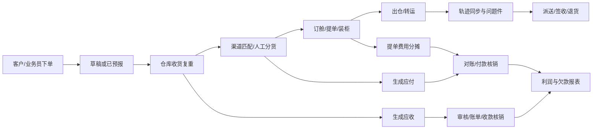

# T6 跨境物流系统竞品深度调研总报告

> 调研日期：2026-07-22（Asia/Shanghai）  
> 调研对象：T6 跨境物流系统，不是用友 T6 或其他同名软件  
> 目标：为“功能与工作流高度接近、品牌和表达独立”的新产品提供决策依据  
> 证据口径：`已核验事实`=公开来源直接支持；`高可信推断`=多项证据一致但未获厂商确认；`待验证假设`=必须进演示环境或访谈后确认

## 1. 结论先行

T6 是面向跨境货代、国际专线、自主装柜、快递小包和尾程服务商的业务财务一体化系统。它不是一个“运单 CRUD”，而是一套把客户下单、报价、仓库扫描、转运订舱、轨迹与问题件、应收应付、客户门户、PDA、微信机器人和外部接口串成闭环的行业 ERP/TMS。【已核验事实】官方当前网站与完整在线手册共同支持这个定位。[当前官网](https://www.t6soft.com/) · [产品手册入口](https://doc.t6soft.com/#/docs/t6/761)

公开手册目前可解析出 **22 个一级目录、171 个目录节点、130 篇有正文的操作文档、861 张嵌入截图**。用户给出的 `/761` 只是“基本操作指南”，并非产品总览。【已核验事实】本报告已遍历公开文档树并抽取正文；统计值是 2026-07-22 的快照。

如果目标是“做得像”，真正要复刻的是四个底层能力，而不是蓝绿色界面：

1. **运单与提单的状态机**：预报、收货、分货、转运、派送、发货、上网、签收、退货、问题件；
2. **配置化规则引擎**：渠道报价、分区、附加费、限制、计费重、单号生成、触发器和通知；
3. **可追溯的财务闭环**：应收/应付生成、审核/反审核、账单、核销、余额、汇率、分摊、锁单；
4. **多角色、多终端协同**：内部员工、客户、代理、仓库 PDA、个人/企业微信机器人、API 和平台对接。

最佳产品策略不是照抄现有视觉，而是采用“**T6 的业务心智与任务路径 + 独立设计系统 + 更现代的可用性**”。执行顺序建议是：先把核心闭环做到高保真，再扩模块；架构上从一开始就按规则、状态、权限、审计和财务不变量建设。单纯像素复刻能快速出展示，但会把 T6 的历史交互负担、维护成本和法律风险一起复制过来。

## 2. 产品身份与市场定位

### 2.1 已确认身份

- 【已核验事实】当前品牌官网称该产品由深圳市跨境伙伴网络科技有限公司提供，定位于跨境物流/国际专线系统；公开登录页版权信息与此一致。[当前官网](https://www.t6soft.com/) · [公开登录页](https://dev.t6soft.com/)
- 【已核验事实】旧版产品介绍位于易宇通相关站点，称 T6 以既有 K5 经验为基础，服务国际专线、自营专线和跨境货代。[旧版产品介绍](https://kingtrans.net/t6/)
- 【待验证假设】“跨境伙伴”与“易宇通科技”的当前股权、授权、品牌和交付关系，公开页面不足以准确界定，商务采购或法务尽调时应索取主体、合同和知识产权证明。
- 【已核验事实】当前公开登录支持员工账号、微信扫码和客户登录；客户登录页存在注册与中英文入口。[员工登录页](https://dev.t6soft.com/) · [客户登录页](https://omt.t6soft.com/clogon?locale=en_US)

### 2.2 目标客户与使用场景

| 客群 | 典型业务 | T6 对应能力 | 证据等级 |
|---|---|---|---|
| 国际专线/跨境货代 | 揽收、入仓、分货、订舱、出仓、轨迹、结算 | 运单、仓库扫描、提单、客服、财务 | 已核验事实 |
| 快递/外配小包 | 批量下单、面单、代理比价、轨迹、问题件 | 快递外配流程、渠道报价、服务商接口 | 已核验事实 |
| 自主装柜/拼柜庄家 | 装柜、提单、报关、集包、卡板、分摊 | 装柜庄家版流程、提单应付 | 已核验事实 |
| 尾程/合作尾程 | 扫描打托、派送、POD、尾程财务 | 尾程与合作尾程模块、PDA | 已核验事实 |
| 货代客户 | 自助下单、查价、查轨迹、账单和支付记录 | 客户端/客户门户、公众号、API | 已核验事实 |

### 2.3 商业模式与版本

- 【高可信推断】系统采用按模块购买/授权的 B2B 软件模式。主页截图显示“已购模块”和到期信息，旧服务页也描述购买模块、升级和培训。[服务说明](https://www.kingtrans.net/services/)
- 【待验证假设】当前公开网络没有找到可核验的价格表、并发许可、按票计费或 SaaS/私有化报价。不要用旧“创业版”页面推断当前价格，需向厂商拿正式报价单和模块清单。
- 【已核验事实】旧服务说明称已购模块可升级、厂商提供周期培训并可提供付费上门支持；这些是旧站政策，当前合同是否沿用必须再确认。[服务说明](https://www.kingtrans.net/services/)
- 【已核验事实】公开系统静态资源带有 `2026.07.13_01` 发布标记；这只能说明资源发布批次，不能直接当作产品语义版本。旧站存在更新记录列表，第三方也有更新摘要。[更新记录](https://service.kingtrans.cn/sysnewslist.jsp) · [第三方版本摘要](https://www.fob6.com/83682/)

## 3. 公开证据覆盖与可信度

本轮研究使用了五类材料：

1. 官方文档站的公开目录与正文接口，并逐页遍历 130 篇正文；
2. 当前和旧版官网、登录页、客户登录页；
3. 官方 API 文档、更新记录和公开教程视频；
4. 第三方版本摘要与同行官网；
5. 官方文档中的 861 张截图，用于还原界面和交互。

需要注意：公开手册能很好地证明“有什么功能、操作路径是什么”，但无法完整证明真实环境中的性能、权限边界、异常提示、数据隔离、并发、计费、SLA 和售后质量。厂商官网中的客户评价是厂商自有营销材料，不等同于独立用户评价。

## 4. 产品版图

### 4.1 一级能力地图

| 业务域 | 核心能力 | 业务价值 | 复刻优先级 |
|---|---|---|---|
| 基础资料与组织 | 客户、代理、员工、仓库、币种、费用、地址、权限 | 建立全系统统一主数据 | P0 |
| 渠道与报价 | 渠道、分区、燃油、附加费、限制、特殊价、利润规则、查价 | 可售产品与利润控制 | P0 |
| 运单 | 标准/FBA/导入/客户下单，包裹、品名、收寄件、清关资料 | 业务入口与主单据 | P0 |
| 仓库 | 收货复重、设备测量、分货、出库、中转、打印、PDA | 把预报数据变成实货数据 | P0 |
| 转运/提单 | 订舱、提单、装柜、提货、报关、集包、卡板、FBA 箱号 | 干线与批次作业 | P1 |
| 客服 | 轨迹、问题件、资料补录、扣货/放货 | 在途异常与客户协同 | P0 |
| 财务 | 应收、应付、账单、收付款、核销、分摊、汇率、银行流水 | 盈亏和资金闭环 | P0/P1 |
| 报表 | 收发货、利润、时效、欠款、客户拜访等 | 管理和经营分析 | P1 |
| 客户端 | 自助下单、报价、轨迹、账单、支付、聊天、授权 | 降低客服和录单成本 | P0/P1 |
| 自动化 | 运单/提单触发器、规则表达式、通知模板 | 规模化运营和低代码配置 | P1 |
| 机器人 | 个人微信、企业微信、智能推送、回复、Excel 智能下单 | 贴近客户日常沟通渠道 | P2 |
| 开放集成 | 代理、承运商、平台、保险、官网、API、T6 互通 | 连接上下游生态 | P1/P2 |

更细的页面、对象和动作清单见《T6 功能架构报告》。

### 4.2 核心业务闭环

## 5. 为什么 T6 难以“照着页面做完”

### 5.1 状态不是标签，而是权限和财务的共同输入

“待收货”“待转运”“已发货”等状态决定某个动作是否可用、哪些列表可见、能否生成费用、能否撤销以及信息向谁同步。公开文档还显示问题件在收货前叫“问题订单”，收货后叫“问题运单”；T6 与 T6 数据互推也要求双方状态满足条件。【已核验事实】因此状态迁移必须由后端命令和校验控制，不能只做一个可编辑的 `status` 字段。

### 5.2 报价不是一张价格表

渠道价格由分区、重量段、计费重、燃油、偏远、附加费、限制、客户特殊价、代理价、利润规则和优先级共同决定。一个页面看似只是“查价”，背后是可解释的规则计算。【已核验事实】若早期用散落的 if/else 实现，后续每新增一个代理或国家都会产生回归风险。

### 5.3 财务需要不可破坏的不变量

T6 的应收/应付包含生成、审核、反审核、账单、核销、部分支付、多币种、余额抵扣、锁单、汇率和费用分摊。【已核验事实】这类模块不能以普通表单的“改完就覆盖”实现；至少要有单据版本、操作日志、反向凭证或明确的可逆命令，以及借贷/余额/分摊总额守恒的自动测试。

### 5.4 权限不只是菜单显隐

公开权限截图显示用户组、成员、模块、状态列表、动作和列表字段都可配置，并存在个人/岗位/部门等数据范围。【已核验事实】因此权限模型至少包含：资源、动作、数据范围、字段可见性和组织上下文。

## 6. 交互与视觉总览

T6 是典型的高密度桌面业务系统：深色固定侧栏、顶部多页签工作区、状态计数标签、操作工具条、可配置列的宽表格、分页统计、双击行进入详情，以及大量中大型弹窗。主色接近 Layui 默认青绿色，页面更强调单位面积信息量和批处理效率，而非留白与品牌表现。【已核验事实】官方 `/761` 明确说明列表字段可显隐和拖拽排序、自定义导出字段、各模块支持双击行查看或编辑。[基本操作指南](https://doc.t6soft.com/#/docs/t6/761)

公开登录页可核验到 Layui 2.5.6、LayuiAdmin、jQuery、Handsontable、Math.js、Decimal.js、JSZip 和 docx-preview 等资产；服务器使用 `JSESSIONID` 会话。【已核验事实】`Java/Spring 类后端 + JSP/服务端页面 + AJAX` 是高可信推断，不能仅凭 `JSESSIONID` 断定具体框架。更完整的页面模式、控件规则和改良建议见《T6 交互与视觉报告》。

## 7. 学习与复刻路线

### 7.1 推荐策略

采用“**核心路径高保真、表达与架构独立**”的策略：

- 业务心智保持接近：菜单分组、状态名称、批量操作、双击详情、列配置、打印/导入/导出习惯可以兼容行业用户；
- 视觉表达独立：名称、Logo、图标、色彩、字体、文案、截图、模板、动效和组件细节全部重做；
- 技术实现独立：不获取、不反编译、不复用对方代码和非公开接口；根据公开行为规格和自有业务访谈重新建模；
- 体验适度升级：保留密度，但增加明确主操作、错误定位、保存状态、撤销/反操作说明、键盘效率和跨页任务上下文。

### 7.2 六阶段执行法

| 阶段 | 产出 | 预计周期 | 退出条件 |
|---|---|---:|---|
| 0. 合法取证与试用 | 正式演示授权、多角色账号、模块/价格/SLA 清单 | 1–2 周 | 关键未知项有书面答案 |
| 1. 行为研究 | 页面地图、任务录像、字段字典、状态/异常/权限矩阵 | 2–4 周 | 20 条高频任务可完整复述 |
| 2. 领域建模 | ERD、状态机、规则 DSL、权限模型、财务不变量 | 2–3 周 | 架构评审通过，核心例外有归属 |
| 3. 高保真原型 | 桌面端 P0 原型、导入/扫描/批量/异常态 | 4–6 周 | 目标用户完成率与用时达标 |
| 4. 核心闭环开发 | 主数据、渠道、运单、收货、分货、轨迹、核心结算 | 4–6 个月 | 真实沙盒订单跑通且账实一致 |
| 5. 广度扩展 | 提单/PDA/报表/自动化/门户/集成/机器人 | 5–12+ 月 | 模块验收矩阵达到目标覆盖率 |

周期是基于当前公开范围的工程判断，不是厂商工期承诺。一个 6–8 人团队做可生产的核心闭环，现实区间约 4–6 个月；达到大部分运营能力约 9–12 个月；覆盖财务深度、PDA、机器人和主要生态对接通常需 12–18 个月以上、8–12 人持续投入。

### 7.3 版本优先级

**P0：必须先形成业务闭环**

- 登录、租户/组织、用户组、角色、数据范围、操作日志；
- 客户/客户账号、代理、渠道、分区、报价、附加费和基础规则；
- 标准/FBA/批量导入下单、包裹和品名；
- 生命周期列表、收货复重、人工/规则分货、出仓；
- 轨迹、问题件、附件、备注、打印、导入、导出；
- 应收、应付、审核、账单、收付款和基础核销；
- 客户端基础下单、查价、查轨迹、查账单。

**P1：形成规模化运营能力**

- 订舱、提单、装柜、报关、集包、卡板、费用分摊；
- PDA 仓储作业；
- 完整触发器、通知中心、经营报表；
- 客户 API、代理/承运商接口、核心平台对接；
- 多币种、银行流水、余额、欠款和锁货策略。

**P2：形成差异化生态**

- 个人/企业微信机器人、智能回复和 Excel 智能下单；
- 在线支付、公众号、全部电商平台与保险对接；
- 尾程/合作尾程高级能力、少见定制规则和行业模板市场。

## 8. 验收方法

“看起来像”不是验收标准。建议建立页面 × 角色 × 状态 × 动作的行为矩阵，至少覆盖：

- 20 条核心任务的成功率、完成时间、点击/键盘次数和错误恢复率；
- 每个状态的合法迁移、非法迁移、撤销和权限负例；
- 报价逐项解释、边界重量、优先级冲突和舍入方式；
- 应收/应付审核、反审核、部分核销、汇率、余额和分摊守恒；
- 1、100、1,000、10,000 条数据的列表、批量操作、导入和导出性能；
- 1440×900 与 1920×1080 两种桌面视口的视觉差异；
- 面单、账单、装箱单等输出物的 Golden File 对比；
- API 幂等、重试、限流、签名、错误码和回调顺序；
- 租户隔离、字段脱敏、审计留存、备份恢复和高风险操作二次确认。

## 9. 尚未公开确认的问题

在开始大规模开发前，应向厂商演示、客户访谈或自有业务方确认：

1. 当前产品的 SaaS、私有化和模块报价分别是什么？
2. 租户、公司、部门、站点、仓库的数据隔离边界是什么？
3. 许可按账号、并发、票量、模块还是接口调用收费？
4. 生产环境的 SLA、备份、灾备、RPO/RTO 和数据导出承诺是什么？
5. 单租户真实最大运单量、并发扫描量、批量导入量和报表耗时是多少？
6. 支持哪些浏览器和最低分辨率？PDA 是否支持离线、断点续传和扫码枪广播？
7. 权限能否做到字段读写、费用脱敏、跨部门共享和临时授权？
8. 运单和费用审核后哪些字段不可修改？反审核如何留痕？
9. 财务是否具备会计期间锁定、凭证接口、税率、发票和坏账处理？
10. API 的鉴权续期、限流、幂等键、回调、分页上限和错误码稳定性如何？
11. 当前可用的承运商、代理、平台、保险和支付接口清单是什么？
12. 通知失败如何重试、去重、告警；客户是否能退订？
13. 个人微信机器人是否符合平台规则，账号封禁和数据隐私风险由谁承担？
14. “智能下单”的模型、训练方式、数据留存、准确率和人工复核机制是什么？
15. 多语言、多时区、多币种的显示、计费日和汇率时点规则是什么？
16. 模板、触发器和定制开发在升级时如何迁移和兼容？
17. 数据迁移支持哪些来源、校验、回滚和增量切换方式？
18. 客户端与内部端的消息、附件和账单是否实时一致？
19. 打印格式、Excel 模板和 API 字段是否有稳定版本或变更通知？
20. 审计日志保存多久，管理员是否能删除，能否导出用于争议处理？

## 10. 法律与合规边界

本节不是法律意见。中国现行《反不正当竞争法》于 2025-06-27 通过修订、2025-10-15 起施行；软件表达也受到著作权和软件保护法规约束。[国家法律法规数据库](https://flk.npc.gov.cn/detail?fileId=&id=ff808181971552b40197b1016efc5437&title=%E4%B8%AD%E5%8D%8E%E4%BA%BA%E6%B0%91%E5%85%B1%E5%92%8C%E5%9B%BD%E5%8F%8D%E4%B8%8D%E6%AD%A3%E5%BD%93%E7%AB%9E%E4%BA%89%E6%B3%95&type=) · [著作权法](https://www.npc.gov.cn/c2/c30834/202011/t20201119_308796.html) · [计算机软件保护条例](https://xzfg.moj.gov.cn/front/law/detail?LawID=913) · [市场监管总局仿冒混淆规则](https://www.samr.gov.cn/zw/zfxxgk/fdzdgknr/bgt/art/2023/art_cab135647b164d7eb0c7557ead860800.html)

建议执行 clean-room：研究人员产出“业务行为与字段要求”，另一组开发人员基于该规格独立实现；保留来源和决策记录。可以学习通用业务流程、数据关系和操作方法，但不要复制源代码、数据库、非公开接口、商标、名称、图标、页面文案、截图、帮助文档、打印模板或具有识别性的整体装潢。上线前让合资格律师审查品牌、界面近似、数据来源、机器人合规、隐私和合同边界。

## 11. 线上材料索引

### T6 官方及关联材料

- [T6 当前官网](https://www.t6soft.com/)
- [T6 在线手册：基本操作指南](https://doc.t6soft.com/#/docs/t6/761)
- [T6 API 文档](https://yht.t6soft.com/api/doc)
- [T6 公开登录页](https://dev.t6soft.com/)
- [T6 客户登录页](https://omt.t6soft.com/clogon?locale=en_US)
- [旧版 T6 产品介绍](https://kingtrans.net/t6/)
- [厂商服务说明](https://www.kingtrans.net/services/)
- [系统更新列表](https://service.kingtrans.cn/sysnewslist.jsp)
- [微信服务平台](https://www.k-wei.net/)
- [B 站公开教程示例：系统通知配置](https://www.bilibili.com/video/BV1jRXaBnEK2/)

### 行业参照

- [海管家](https://www.hgj.com/aboutus) · [海管家 e 云](https://eyun.hgj.com/)
- [大掌柜](https://www.cargogm.com/)
- [麦哲伦 M-TMS](https://www.mzlsoft.com/tms/)

### 研究说明

第三方材料用于交叉验证，不把营销表述当成客观效果。抖音、小红书和部分公众号页面存在登录、动态渲染或反爬限制，本轮未能稳定核验的口碑、价格和演示细节均没有写成事实。若取得正式演示账号，下一轮应重点补齐异常态、真实响应速度、完整权限、账务锁定和移动端弱网体验。
